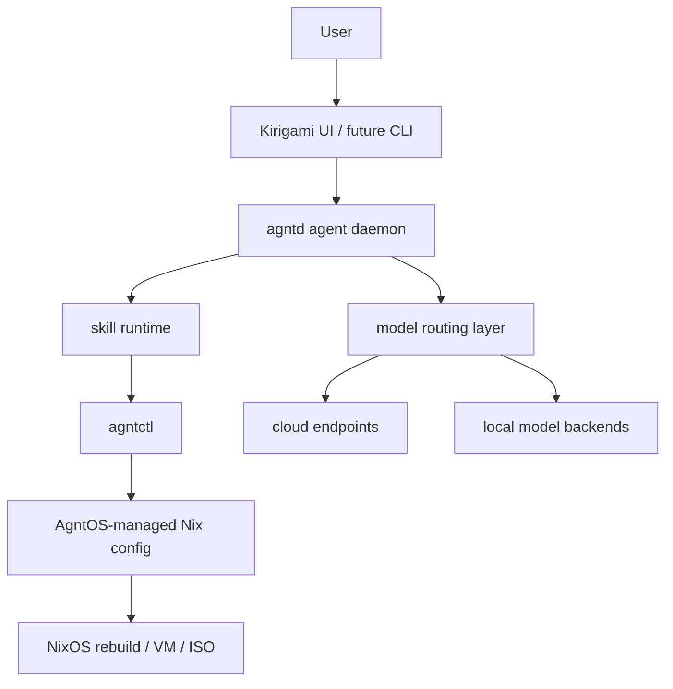

# AgntOS Foundation Design

## Overview

AgntOS is structured as a NixOS flake with Rust system tools and a Plasma/Kirigami user experience. The foundation separates distro composition, OS control, agent runtime, model routing, and UI so each can evolve independently.



## Repository Shape

Initial target structure:

```text
agntos/
  flake.nix
  flake.lock
  modules/
    agntos/
      base.nix
      desktop-plasma.nix
      agent.nix
      model-routing.nix
      vm.nix
  profiles/
    dev-vm.nix
    plasma.nix
    iso.nix
  pkgs/
    agntctl/
    agntd/
    agnt-settings/
  crates/
    agntctl/
    agntd/
    agnt-common/
  skills/
    os/
      inspect-hardware/
      edit-nix-config/
      enable-service/
      install-app/
  .specs/
```

This structure can change as the implementation teaches us more, but the separation between modules, profiles, packages, crates, and skills should remain.

## NixOS Layer

The Nix layer owns:

- System module definitions.
- Plasma desktop defaults.
- Dev VM output.
- Future ISO output.
- Packaging for AgntOS Rust binaries.
- User and system service definitions.

The dev VM should be real NixOS, not a local root directory. For fast iteration, the VM should mount the local repository into the guest so binaries/UI can run in dev mode while release builds remain reproducible.

## `agntctl`

`agntctl` is the stable OS-control surface.

Initial command families:

- `agntctl inspect`: read-only system and config inspection.
- `agntctl config`: inspect and edit AgntOS-managed Nix config.
- `agntctl propose`: produce planned changes and diffs.
- `agntctl apply`: apply approved changes.
- `agntctl audit`: show prior actions.
- `agntctl rollback`: explain or trigger rollback paths.

Direct Nix editing is allowed, but v0 should scope edits to an AgntOS-managed config tree. Arbitrary user Nix editing can be considered later.

## `agntd`

`agntd` is the Hermes-like local agent service.

Responsibilities:

- Chat/session management.
- Tool execution through `agntctl`.
- Skill loading.
- Model routing.
- Memory hooks.
- Approval requests.
- Audit integration.

Open design choice: `agntd` may start as a CLI-driven daemon before a full Kirigami UI exists. The spec allows that if it speeds foundation work.

## Model Routing

Model routing should be task-class based, not hardcoded.

Initial task classes:

- `general_chat`
- `os_planning`
- `nix_editing`
- `code_editing`
- `log_analysis`
- `private_local`
- `fast_background`
- `vision_context` later

Each task class can point to a provider/model pair. Providers may be cloud endpoints, OpenAI-compatible APIs, or local backends.

## UI Layer

Kirigami is the likely v0 GUI toolkit because AgntOS targets Plasma. The UI should eventually include:

- Agent chat.
- Approval prompts.
- Model routing settings.
- API key and endpoint setup.
- Local model management.
- Permissions and audit log.

A CLI or TUI can exist as a development interface, but it is not a separate product target in the first Plasma-only scope.

## Safety And Audit

Every OS-changing action should record:

- Requested task.
- Actor: user, agent, or system.
- Proposed config change.
- Applied files.
- Command or rebuild result.
- Rollback hint.
- Timestamp.

The initial audit log can be a simple structured local file. The format should remain easy to inspect and migrate.

## Extension Points

- Alternate desktop editions.
- AI Anywhere overlay.
- Background automation workspace.
- Additional model backends.
- Hermes integration or fork.
- Stronger policy engine.
- GUI installer customization.
