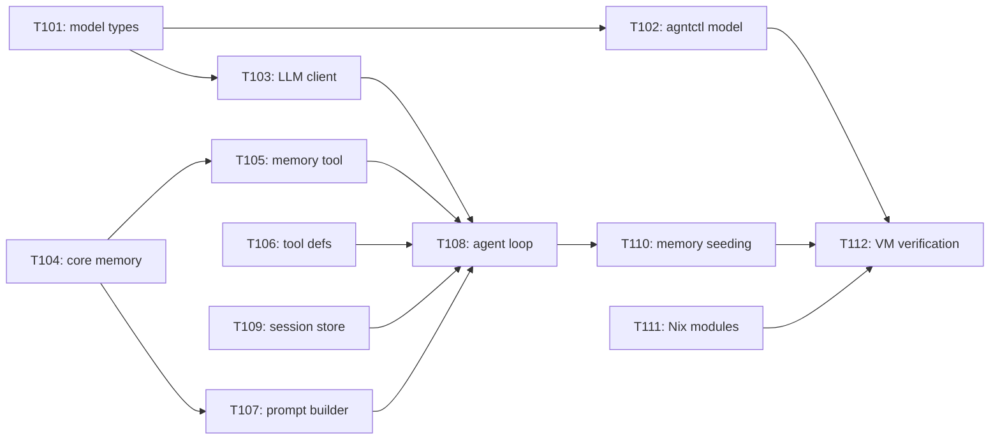

# AgntOS Foundation Tasks

## Task Status

- `[ ]` Pending
- `[~]` In progress
- `[x]` Complete
- `[!]` Blocked

## Phase 0 Tasks (Foundation)

### T001: Create Initial Nix Flake

Status: `[x]`

Requirements: AGF-001, AGF-002

Done when:
- `nix flake check` can evaluate or fails only on explicitly documented missing package implementations.
- The module/profile structure exists.
- Plasma is the only desktop profile.

Note: Completed and tested with agntos-dev-vm building and booting in QEMU.

### T002: Add Dev VM Profile

Status: `[x]`

Requirements: AGF-003

Done when:
- The dev VM config builds from Nix.
- The planned host source mount path is documented.
- The VM root remains Nix-built.

Note: VM boots, SSH on port 2222, shared folder mounts, tools build and run inside VM.

### T003: Initialize Rust Workspace

Status: `[x]`

Requirements: AGF-004

Done when:
- `cargo check` succeeds for placeholder crates.
- `agntctl` and `agntd` binaries exist as minimal stubs.

Note: 19 tests passing, 0 warnings. Full implementations for inspect, propose, apply, audit.

### T004: Package Rust Tools In Nix

Status: `[x]`

Requirements: AGF-001, AGF-004

Done when:
- The flake exposes packages for `agntctl` and `agntd`.
- The dev VM includes the tools.

### T005: Define AgntOS Managed Config Tree

Status: `[x]`

Requirements: AGF-005, AGF-008

Done when:
- The config path is documented.
- The boundary between AgntOS-managed config and arbitrary user config is explicit.
- Open questions around Nix vs TOML/YAML are narrowed or documented.

Note: `/etc/agntos/` owned by agntctl. Proposal JSON, audit JSONL, memory files, and models.toml all live within this tree.

### T006: Implement `agntctl inspect`

Status: `[x]`

Requirements: AGF-004, AGF-005

Done when:
- `agntctl inspect system` prints basic OS, kernel, desktop, CPU, memory, and GPU info where available.
- The command does not require elevated privileges for basic info.

### T007: Implement `agntctl propose`

Status: `[x]`

Requirements: AGF-005, AGF-006

Done when:
- A command can generate a planned config change without applying it.
- The proposal includes target files and a human-readable summary.

### T008: Implement Audit Log Skeleton

Status: `[x]`

Requirements: AGF-005, AGF-006

Done when:
- OS actions can append audit entries.
- `agntctl audit list` can read entries.
- The log format is documented.

### T009: Add Minimal `agntd` Agent Stub

Status: `[x]`

Requirements: AGF-006

Done when:
- `agntd` can run as a user/session process.
- It can invoke or link to the OS inspect functionality.
- It is packaged into the dev VM.

Note: Keyword-matching REPL replaced by LLM-powered agent loop in Phase 1.

### T010: Define Model Routing Config

Status: `[x]`

Requirements: AGF-007

Done when:
- Task classes are documented.
- Provider/model assignment format is documented.
- OpenAI-compatible endpoint support is represented.
- Local backend support is represented as an extension point.
- TOML format chosen and documented.
- No hardcoded model endpoints or defaults.

Note: Implemented. models.toml format, agntctl model list/route subcommands, VM-validated.

### T011: Create Minimal Kirigami Direction Doc

Status: `[x]`

Requirements: AGF-002, AGF-006, AGF-007

Done when:
- The first UI surfaces are listed.
- CLI/dev interface fallback is explicitly allowed.
- Plasma-only scope is restated.

Note: Deferred. CLI/agent interface sufficient for Phase 1.

### T012: Build First End-To-End Demo

Status: `[x]`

Requirements: AGF-001 through AGF-009

Done when:
- AgntOS boots in a dev VM.
- A user can run an early assistant or CLI.
- The assistant/tool can inspect the OS.
- The project can explain the next safe config-change path.

Verification: Completed. agntctl propose/apply/audit + agntd agent loop verified inside QEMU VM.

## Phase 1 Tasks (Agent OS Foundation)

### T101: Model Routing Config Types

Status: `[x]`

Requirements: AGF-007

What:
Define the `models.toml` schema as Rust types in `agnt-common`.

Where:
- `crates/agnt-common/src/models.rs`

Done when:
- `ModelsConfig`, `ModelProfile`, and routing map types exist with serde deserialization.
- The format supports endpoint, model name, api_key_env, max_tokens, temperature.
- No hardcoded model endpoints or default values.

### T102: `agntctl model` Subcommand

Status: `[x]`

Requirements: AGF-007

What:
Add `agntctl model list` and `agntctl model route <task>` commands.

Where:
- `crates/agntctl/src/model.rs`
- `crates/agntctl/src/main.rs`

Done when:
- `agntctl model list` shows all configured model profiles.
- `agntctl model route <task>` shows which profile handles the given task class.
- Subcommand works in the dev VM.

### T103: LLM Client Module

Status: `[x]`

Requirements: AGF-006

What:
Create an LLM API client in `agntd` that calls OpenAI-compatible `/v1/chat/completions`.

Where:
- `crates/agntd/src/llm.rs`

Done when:
- Client can send messages and receive responses.
- Client supports tool_calls in responses.
- Client handles errors and retries with backoff.
- Endpoint, model, and auth are read from `models.toml`.
- Streaming support if feasible.

### T104: Core Memory System

Status: `[x]`

Requirements: AGF-006

What:
Implement the Hermes-style bounded curated memory system.

Where:
- `crates/agnt-common/src/memory.rs`
- `crates/agntd/src/memory.rs`

Done when:
- `CoreMemory` can load/save `MEMORY.md` and `USER.md`.
- `add`, `replace`, `remove` operations work with substring matching.
- Character capacity limits are enforced (2,200 for MEMORY, 1,375 for USER).
- Usage percentage tracking and capacity management (>80% warning, 100% error).
- Security scanner blocks prompt injection, credential exfiltration, invisible Unicode.
- Memory is loaded as frozen snapshot at session start.

### T105: Memory Tool

Status: `[x]`

Requirements: AGF-006

What:
Implement the `memory` tool definition for LLM function calling, backed by CoreMemory.

Where:
- `crates/agntd/src/tools.rs`

Done when:
- LLM receives `memory` as a callable tool with add/replace/remove actions.
- Tool execution persists changes to disk.
- Security scanning runs on every write.
- Capacity management returns appropriate errors.

### T106: Tool Definitions

Status: `[x]`

Requirements: AGF-006

What:
Define all `agntctl` operations as OpenAI function tools.

Where:
- `crates/agntd/src/tools.rs`

Done when:
- `inspect`, `propose`, `apply`, `audit`, and `memory` are defined as typed tools.
- Each tool has a name, description, and parameter schema.
- Tool execution maps to `agntctl` subprocess calls.

### T107: System Prompt Builder

Status: `[x]`

Requirements: AGF-006

What:
Build the system prompt from memory snapshot, system profile, and tool definitions.

Where:
- `crates/agntd/src/prompt.rs`

Done when:
- System prompt includes MEMORY.md content, USER.md content, current system profile, and rules.
- Profile data comes from `agntctl inspect` output.
- Initial MEMORY.md is seeded from `agntctl inspect` on first run.
- Rules enforce propose-before-apply, confirmation for destructive ops.

### T108: LLM-Powered Agent Loop

Status: `[x]`

Requirements: AGF-006

What:
Replace the keyword-matching REPL with an LLM-powered tool-calling loop.

Where:
- `crates/agntd/src/agent.rs`
- `crates/agntd/src/main.rs`

Done when:
- User input is sent to LLM with system prompt and tools.
- Tool calls are parsed, executed via agntctl, results returned to LLM.
- Non-tool responses are displayed to user.
- Loop continues until user exits.
- Confirmation prompt for `apply` before execution.
- Tool call depth limit prevents infinite regress.

### T109: Session Store

Status: `[x]`

Requirements: AGF-006

What:
Create SQLite FTS5 session store for historical query search.

Where:
- `crates/agntd/src/session.rs`

Done when:
- Conversation turns are saved to SQLite database at `/etc/agntos/memory/sessions.db`.
- FTS5 full-text search works for content queries.
- Search results are returned as summaries.
- Database is created and migrated automatically.

### T110: Initial Memory Seeding

Status: `[x]`

Requirements: AGF-006

What:
Seed initial `MEMORY.md` from `agntctl inspect` output on first run.

Where:
- `crates/agntd/src/prompt.rs`
- `crates/agnt-common/src/memory.rs`

Done when:
- First run populates MEMORY.md with hardware info, OS version, hostname, memory, disk.
- Subsequent runs load existing memory rather than overwriting.
- Agent can build on the seeded facts.

### T111: Nix Module Updates

Status: `[x]`

Requirements: AGF-005, AGF-006, AGF-007

What:
Update NixOS modules to support new config files and directories.

Where:
- `modules/agntos/base.nix`
- `modules/agntos/agent.nix`

Done when:
- `models.toml` path is created in the config tree.
- Memory directory (`/etc/agntos/memory/`) is created.
- `agntd` systemd user service starts on login.

### T112: End-to-End VM Verification

Status: `[x]`

Requirements: AGF-001 through AGF-009

What:
Verify the full Phase 1 stack in the dev VM.

Done when:
- VM boots with all Phase 1 changes.
- User configures a model endpoint in `models.toml`.
- Agent starts and loads memory.
- Agent can inspect, propose, and apply changes.
- Agent remembers facts across sessions.
- All changes are audited.
- Rollback guidance is available.

## Task Dependencies

