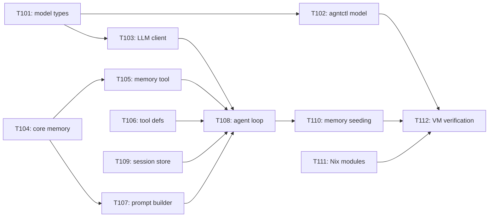

# AgntOS Foundation Tasks

## Task Status

- `[ ]` Pending
- `[~]` In progress
- `[x]` Complete
- `[!]` Blocked

## Phase 0 Tasks (Foundation)

### T001: Create Initial Nix Flake

Status: `[x]`

Requirements: AGF-001, AGF-002

Done when:
- `nix flake check` can evaluate or fails only on explicitly documented missing package implementations.
- The module/profile structure exists.
- Plasma is the only desktop profile.

Note: Completed and tested with agntos-dev-vm building and booting in QEMU.

### T002: Add Dev VM Profile

Status: `[x]`

Requirements: AGF-003

Done when:
- The dev VM config builds from Nix.
- The planned host source mount path is documented.
- The VM root remains Nix-built.

Note: VM boots, SSH on port 2222, shared folder mounts, tools build and run inside VM.

### T003: Initialize Rust Workspace

Status: `[x]`

Requirements: AGF-004

Done when:
- `cargo check` succeeds for placeholder crates.
- `agntctl` and `agntd` binaries exist as minimal stubs.

Note: 19 tests passing, 0 warnings. Full implementations for inspect, propose, apply, audit.

### T004: Package Rust Tools In Nix

Status: `[x]`

Requirements: AGF-001, AGF-004

Done when:
- The flake exposes packages for `agntctl` and `agntd`.
- The dev VM includes the tools.

### T005: Define AgntOS Managed Config Tree

Status: `[x]`

Requirements: AGF-005, AGF-008

Done when:
- The config path is documented.
- The boundary between AgntOS-managed config and arbitrary user config is explicit.
- Open questions around Nix vs TOML/YAML are narrowed or documented.

Note: `/etc/agntos/` owned by agntctl. Proposal JSON, audit JSONL, memory files, and models.toml all live within this tree.

### T006: Implement `agntctl inspect`

Status: `[x]`

Requirements: AGF-004, AGF-005

Done when:
- `agntctl inspect system` prints basic OS, kernel, desktop, CPU, memory, and GPU info where available.
- The command does not require elevated privileges for basic info.

### T007: Implement `agntctl propose`

Status: `[x]`

Requirements: AGF-005, AGF-006

Done when:
- A command can generate a planned config change without applying it.
- The proposal includes target files and a human-readable summary.

### T008: Implement Audit Log Skeleton

Status: `[x]`

Requirements: AGF-005, AGF-006

Done when:
- OS actions can append audit entries.
- `agntctl audit list` can read entries.
- The log format is documented.

### T009: Add Minimal `agntd` Agent Stub

Status: `[x]`

Requirements: AGF-006

Done when:
- `agntd` can run as a user/session process.
- It can invoke or link to the OS inspect functionality.
- It is packaged into the dev VM.

Note: Keyword-matching REPL replaced by LLM-powered agent loop in Phase 1.

### T010: Define Model Routing Config

Status: `[x]`

Requirements: AGF-007

Done when:
- Task classes are documented.
- Provider/model assignment format is documented.
- OpenAI-compatible endpoint support is represented.
- Local backend support is represented as an extension point.
- TOML format chosen and documented.
- No hardcoded model endpoints or defaults.

Note: Implemented. models.toml format, agntctl model list/route subcommands, VM-validated.

### T011: Create Minimal Kirigami Direction Doc

Status: `[x]`

Requirements: AGF-002, AGF-006, AGF-007

Done when:
- The first UI surfaces are listed.
- CLI/dev interface fallback is explicitly allowed.
- Plasma-only scope is restated.

Note: Deferred. CLI/agent interface sufficient for Phase 1.

### T012: Build First End-To-End Demo

Status: `[x]`

Requirements: AGF-001 through AGF-009

Done when:
- AgntOS boots in a dev VM.
- A user can run an early assistant or CLI.
- The assistant/tool can inspect the OS.
- The project can explain the next safe config-change path.

Verification: Completed. agntctl propose/apply/audit + agntd agent loop verified inside QEMU VM.

## Phase 1 Tasks (Agent OS Foundation)

### T101: Model Routing Config Types

Status: `[x]`

Requirements: AGF-007

What:
Define the `models.toml` schema as Rust types in `agnt-common`.

Where:
- `crates/agnt-common/src/models.rs`

Done when:
- `ModelsConfig`, `ModelProfile`, and routing map types exist with serde deserialization.
- The format supports endpoint, model name, api_key_env, max_tokens, temperature.
- No hardcoded model endpoints or default values.

### T102: `agntctl model` Subcommand

Status: `[x]`

Requirements: AGF-007

What:
Add `agntctl model list` and `agntctl model route <task>` commands.

Where:
- `crates/agntctl/src/model.rs`
- `crates/agntctl/src/main.rs`

Done when:
- `agntctl model list` shows all configured model profiles.
- `agntctl model route <task>` shows which profile handles the given task class.
- Subcommand works in the dev VM.

### T103: LLM Client Module

Status: `[x]`

Requirements: AGF-006

What:
Create an LLM API client in `agntd` that calls OpenAI-compatible `/v1/chat/completions`.

Where:
- `crates/agntd/src/llm.rs`

Done when:
- Client can send messages and receive responses.
- Client supports tool_calls in responses.
- Client handles errors and retries with backoff.
- Endpoint, model, and auth are read from `models.toml`.
- Streaming support if feasible.

### T104: Core Memory System

Status: `[x]`

Requirements: AGF-006

What:
Implement the Hermes-style bounded curated memory system.

Where:
- `crates/agnt-common/src/memory.rs`
- `crates/agntd/src/memory.rs`

Done when:
- `CoreMemory` can load/save `MEMORY.md` and `USER.md`.
- `add`, `replace`, `remove` operations work with substring matching.
- Character capacity limits are enforced (2,200 for MEMORY, 1,375 for USER).
- Usage percentage tracking and capacity management (>80% warning, 100% error).
- Security scanner blocks prompt injection, credential exfiltration, invisible Unicode.
- Memory is loaded as frozen snapshot at session start.

### T105: Memory Tool

Status: `[x]`

Requirements: AGF-006

What:
Implement the `memory` tool definition for LLM function calling, backed by CoreMemory.

Where:
- `crates/agntd/src/tools.rs`

Done when:
- LLM receives `memory` as a callable tool with add/replace/remove actions.
- Tool execution persists changes to disk.
- Security scanning runs on every write.
- Capacity management returns appropriate errors.

### T106: Tool Definitions

Status: `[x]`

Requirements: AGF-006

What:
Define all `agntctl` operations as OpenAI function tools.

Where:
- `crates/agntd/src/tools.rs`

Done when:
- `inspect`, `propose`, `apply`, `audit`, and `memory` are defined as typed tools.
- Each tool has a name, description, and parameter schema.
- Tool execution maps to `agntctl` subprocess calls.

### T107: System Prompt Builder

Status: `[x]`

Requirements: AGF-006

What:
Build the system prompt from memory snapshot, system profile, and tool definitions.

Where:
- `crates/agntd/src/prompt.rs`

Done when:
- System prompt includes MEMORY.md content, USER.md content, current system profile, and rules.
- Profile data comes from `agntctl inspect` output.
- Initial MEMORY.md is seeded from `agntctl inspect` on first run.
- Rules enforce propose-before-apply, confirmation for destructive ops.

### T108: LLM-Powered Agent Loop

Status: `[x]`

Requirements: AGF-006

What:
Replace the keyword-matching REPL with an LLM-powered tool-calling loop.

Where:
- `crates/agntd/src/agent.rs`
- `crates/agntd/src/main.rs`

Done when:
- User input is sent to LLM with system prompt and tools.
- Tool calls are parsed, executed via agntctl, results returned to LLM.
- Non-tool responses are displayed to user.
- Loop continues until user exits.
- Confirmation prompt for `apply` before execution.
- Tool call depth limit prevents infinite regress.

### T109: Session Store

Status: `[x]`

Requirements: AGF-006

What:
Create SQLite FTS5 session store for historical query search.

Where:
- `crates/agntd/src/session.rs`

Done when:
- Conversation turns are saved to SQLite database at `/etc/agntos/memory/sessions.db`.
- FTS5 full-text search works for content queries.
- Search results are returned as summaries.
- Database is created and migrated automatically.

### T110: Initial Memory Seeding

Status: `[x]`

Requirements: AGF-006

What:
Seed initial `MEMORY.md` from `agntctl inspect` output on first run.

Where:
- `crates/agntd/src/prompt.rs`
- `crates/agnt-common/src/memory.rs`

Done when:
- First run populates MEMORY.md with hardware info, OS version, hostname, memory, disk.
- Subsequent runs load existing memory rather than overwriting.
- Agent can build on the seeded facts.

### T111: Nix Module Updates

Status: `[x]`

Requirements: AGF-005, AGF-006, AGF-007

What:
Update NixOS modules to support new config files and directories.

Where:
- `modules/agntos/base.nix`
- `modules/agntos/agent.nix`

Done when:
- `models.toml` path is created in the config tree.
- Memory directory (`/etc/agntos/memory/`) is created.
- `agntd` systemd user service starts on login.

### T112: End-to-End VM Verification

Status: `[x]`

Requirements: AGF-001 through AGF-009

What:
Verify the full Phase 1 stack in the dev VM.

Done when:
- VM boots with all Phase 1 changes.
- User configures a model endpoint in `models.toml`.
- Agent starts and loads memory.
- Agent can inspect, propose, and apply changes.
- Agent remembers facts across sessions.
- All changes are audited.
- Rollback guidance is available.

## Task Dependencies

## Phase 1 Expansion — General Tools (Pi-Inspired)

### T201: Implement `agntctl read/write/edit/bash` commands

Status: `[x]`

Requirements: Pi-inspired minimal primitives.

What:
Create `crates/agntctl/src/sys.rs` with four general-purpose tool implementations.

Where:
- `crates/agntctl/src/sys.rs`

Done when:
- `agntctl read <path>` prints file content to stdout.
- `agntctl write <path> --content <text>` creates or overwrites a file.
- `agntctl edit <path> --old <string> --new <string>` replaces text in a file.
- `agntctl bash <command>` runs `bash -c <command>`, captures stdout/stderr.
- Write ops (`write`, `edit`, `bash`) log to audit JSONL.
- All commands have unit tests.

### T202: Wire general tools into agntctl CLI

Status: `[x]`

Requirements: T201.

What:
Add `Read`, `Write`, `Edit`, `Bash` subcommands to the `agntctl` CLI parser and dispatch handlers.

Where:
- `crates/agntctl/src/main.rs`

Done when:
- `Command::Read`, `Command::Write`, `Command::Edit`, `Command::Bash` exist.
- Dispatch correctly calls the `sys` module functions.
- All existing commands continue to work.

### T203: Define general tools as LLM function tools

Status: `[x]`

Requirements: T201, T202.

What:
Add `read_file`, `write_file`, `edit_file`, `run_bash` to the LLM tool definitions in `agntd`.

Where:
- `crates/agntd/src/llm.rs`

Done when:
- Four new tool schemas exist in `tool_definitions()`.
- Each tool has a clear name, description, and parameter schema.
- The system prompt is rewritten to include the new tools and Pi-inspired rules.

### T204: Wire general tool execution in agent loop

Status: `[x]`

Requirements: T203.

What:
Add match arms for `read_file`, `write_file`, `edit_file`, `run_bash` in the agent's tool execution dispatcher.

Where:
- `crates/agntd/src/agent.rs`

Done when:
- All four tools map to `agntctl` subprocess calls.
- No confirmation prompts (unlike `apply`/`rollback`).
- Tool results are formatted correctly for LLM feedback.

### T205: Audit logging for write/bash tools

Status: `[x]`

Requirements: T201.

What:
Log `write_file`, `edit_file`, and `run_bash` operations to the audit JSONL log.

Where:
- `crates/agntctl/src/audit.rs`
- `crates/agntctl/src/sys.rs`

Done when:
- `write_file` logs path and content length.
- `edit_file` logs path and old→new summary.
- `run_bash` logs full command, exit code, and truncated output.
- `read_file` does NOT generate audit entries.

### T206: VM end-to-end verification

Status: `[x]`

Requirements: T201–T205.

What:
Verify the full 10-tool agent in the QEMU VM against a real LLM endpoint.

Done when:
- All 10 tools work through `agntctl`.
- The agent uses `read_file`, `write_file`, `edit_file`, `run_bash` naturally.
- The agent chains propose+apply without asking "would you like me to apply?"
- Audit log records write and bash mutations.
- Rollback works (list + apply).
- Auto-start service is active.

## Phase 1 Expansion — Daemon Mode & Error Handling

### T207: Socket/daemon mode for agntd

Status: `[x]`

Requirements: Systemd autostart compatibility.

What:
Add `--socket <path>` mode to `agntd` that listens on a Unix domain socket for
one-shot JSON requests instead of running a terminal REPL.

Where:
- `crates/agntd/src/main.rs`
- `crates/agntd/src/agent.rs`

Done when:
- `agntd --socket /run/agntd/agent.sock` starts and listens for connections.
- Each connection reads `{"prompt": "..."}` and returns `{"response": "..."}`.
- The agent loop executes tools and returns the final response text (no printing).
- Confirmation-gated tools (apply, rollback) safely cancel when stdin is not a TTY.
- The systemd user service uses `--socket` mode.

### T208: Rollback transient VM error handling

Status: `[x]`

Requirements: Friendly errors on fresh/transient systems.

What:
Catch `No profile 'system' found` and `no profile version older than the current`
errors from `nixos-rebuild list-generations` and `nixos-rebuild switch --rollback`,
returning user-friendly messages instead of raw nix errors.

Where:
- `crates/agntctl/src/rollback.rs`

Done when:
- `agntctl rollback list` on a fresh system says "No NixOS generations found."
- `agntctl rollback apply` on a fresh system says "No older NixOS generation."
- Raw nix command errors still propagate for other failure modes.

### T209: Eval runbook script

Status: `[x]`

Requirements: Reproducible verification of the full 10-tool stack.

What:
Create a bash runbook at `.specs/features/agntos-foundation/eval-runbook.sh` that
exercises all 10 tools via `agntctl` and the socket-mode `agntd`.

Where:
- `.specs/features/agntos-foundation/eval-runbook.sh`

Done when:
- Script passes all general tool checks (read, write, edit, bash).
- Script passes all OS-native tool checks (inspect, propose, audit, memory).
- Script validates socket-mode agntd with a real prompt.
- Script validates rollback friendly errors on transient systems.

## Phase 1 Expansion — Surgical Rollback, Nix Validation, Option Templates

### T301: Audit tracking for files_written/files_deleted

Status: `[x]`

Requirements: Surgical rollback.

What:
Add `files_written` and `files_deleted` fields to `AuditEntry` and `ConfigProposal`.
Track these in apply/rollback operations.

Where:
- `crates/agnt-common/src/audit.rs`
- `crates/agnt-common/src/config.rs`

Done when:
- `AuditEntry.files_written` and `files_deleted` exist with `#[serde(default)]`.
- `ConfigProposal.files_to_delete` exists with `#[serde(default)]`.
- Apply operation records files written and deleted.

### T302: `agntctl rollback undo` (surgical rollback)

Status: `[x]`

Requirements: T301.

What:
Implement `execute_undo()` in rollback module that reads the audit log, finds the last
successful Apply entry, and reverses its file operations.

Where:
- `crates/agntctl/src/rollback.rs`

Done when:
- `agntctl rollback undo` reads audit log and finds latest Apply entry.
- Files listed in `files_written` are deleted.
- Files listed in `files_deleted` print a warning (cannot restore).
- `nixos-rebuild` runs after cleanup.

### T303: `--persist` flag for apply

Status: `[x]`

Requirements: Production-ready apply.

What:
Add `--persist` flag to `agntctl apply` that uses `nixos-rebuild switch` instead of `test`.

Where:
- `crates/agntctl/src/apply.rs`
- `crates/agntctl/src/main.rs`

Done when:
- `--persist` flag exists and triggers `switch` mode.
- Default behavior remains `test` (ephemeral).
- All existing tests pass.

### T304: Nix expression validation

Status: `[x]`

Requirements: Safe Nix generation.

What:
Add `validate_nix()` function that writes generated content to a temp file and runs
`nix-instantiate --parse`. Rejects proposals with invalid Nix syntax.

Where:
- `crates/agntctl/src/propose.rs`

Done when:
- Every `generate()` call validates output before saving.
- Invalid Nix returns an error to the user.
- If `nix-instantiate` is not available, validation is silently skipped.

### T305: Option-change proposal templates

Status: `[x]`

Requirements: Arbitrary NixOS option configuration.

What:
Add `set <option> <value>` template that generates a proper NixOS module for any
NixOS option. Support strings, bools, numbers, and raw expressions.

Where:
- `crates/agntctl/src/propose.rs`
- `modules/agntos/base.nix`

Done when:
- `propose set networking.hostName myhost` generates correct module.
- `propose set services.openssh.enable false` generates bool value.
- `/etc/agntos/options/` directory is imported by base.nix.
- Tests exist for string, bool, int values.

## Phase 1 Expansion — Memory & Provenance

### T401: Provenance fields on AuditEntry

Status: `[ ]`

Requirements: Contextual memory (the "why").

What:
Add `prompt: Option<String>` and `rationale: Option<String>` to `AuditEntry`.
Pass the user's original prompt and the agent's rationale for the action through
the propose/apply pipeline so the audit log records why changes were made.

Where:
- `crates/agnt-common/src/audit.rs`
- `crates/agntd/src/agent.rs`

Done when:
- `AuditEntry` has `prompt` and `rationale` fields with `#[serde(default)]`.
- Agent passes original prompt through propose/apply tool calls.
- `agntctl audit show <id>` displays provenance fields.
- `agntctl audit search <term>` can find entries by prompt content.

### T402: Memory system prompt optimization

Status: `[ ]`

Requirements: Efficient memory usage.

What:
Update the system prompt instructions to guide the agent away from storing
inspectable system facts in memory. Emphasize storing preferences, intent,
workflow patterns, and non-derivable user context instead.

Where:
- `crates/agntd/src/llm.rs`

Done when:
- System prompt instructs: "Don't store facts you can inspect. Store preferences,
  intent, and context that can't be derived from system state."
- Memory capacity is freed up for higher-value entries.
- Consolidation runs less frequently.

### T403: End-of-session memory consolidation

Status: `[ ]`

Requirements: Automatic memory extraction without Hermes-style background pipeline.

What:
On session end (socket close, idle timeout, or explicit signal), the agent reviews
the conversation turn log and updates MEMORY.md / USER.md with any new facts worth
remembering. Runs `consolidate` automatically afterward.

Where:
- `crates/agntd/src/agent.rs`
- `crates/agnt-common/src/memory.rs`

Done when:
- Socket close triggers memory review step.
- Agent iterates recent session turns and extracts new facts via `memory add`.
- Auto-consolidation runs after additions.
- No separate background extraction pipeline needed.
- User can disable auto-consolidation via config.

## Phase 1 Expansion — Proactive Self-Healing

### T501: System health watchdog loop

Status: `[ ]`

Requirements: Proactive monitoring.

What:
Add a lightweight polling loop to `agntd` that runs every 5 minutes and checks
for specific system anomalies using targeted bash commands.

Where:
- `crates/agntd/src/watchdog.rs` (new)
- `crates/agntd/src/main.rs`

Done when:
- Polling loop runs `systemctl --failed`, `df -h`, `dmesg | grep -i oom`.
- Results are checked against thresholds (e.g., disk > 95%).
- No firehose monitoring — only targeted, cheap checks.
- Loop runs on a timer, not continuously.

### T502: Log triage and fix drafting

Status: `[ ]`

Requirements: T501.

What:
When a watchdog check trips, `agntd` fetches targeted logs (e.g., `journalctl -u <failed_service> -n 50`)
and sends a hidden prompt to the local model to evaluate the issue.

Where:
- `crates/agntd/src/watchdog.rs`

Done when:
- Watchdog trigger fetches targeted logs.
- Local model evaluates: "Is this a config error requiring NixOS change, or transient?"
- If config error: model drafts a `ConfigProposal`.
- If transient: logged as info, no action taken.
- No raw log firehose fed to model — only the relevant 50 lines.

### T503: Notification and proposal queue

Status: `[ ]`

Requirements: T502.

What:
Drafted fixes from watchdog evaluations are saved as pending `ConfigProposal`s.
User receives a desktop notification (or socket response) to review.

Where:
- `crates/agntd/src/watchdog.rs`
- `crates/agntd/src/agent.rs`

Done when:
- Drafted proposals are saved to `/etc/agntos/proposals/`.
- User is notified: "Service X failed. Fix drafted. Run `agntctl propose list`."
- Proposals follow the same propose/apply/audit/undo workflow.
- User can ignore or apply.

## Phase 2 — Model Management & Routing

### T601: Model registry end-to-end

Status: `[ ]`

Requirements: User-configurable model endpoints.

What:
Build the full model management experience: add/remove model profiles, API key
configuration (secure storage), task-class routing UI, and local backend adapter.

Where:
- `crates/agnt-common/src/models.rs`
- `crates/agntctl/src/model.rs`
- `crates/agntd/src/llm.rs`

Done when:
- `agntctl model add` creates a new profile in `models.toml`.
- `agntctl model remove` deletes a profile.
- API keys stored via secure mechanism (not just env vars).
- Task-class routing respects per-task model assignments.
- Local backend (Ollama or llama.cpp) works for simple tasks (chat, log analysis).
- Hardware-aware suggestions work: `agntctl model suggest` picks appropriate model.
