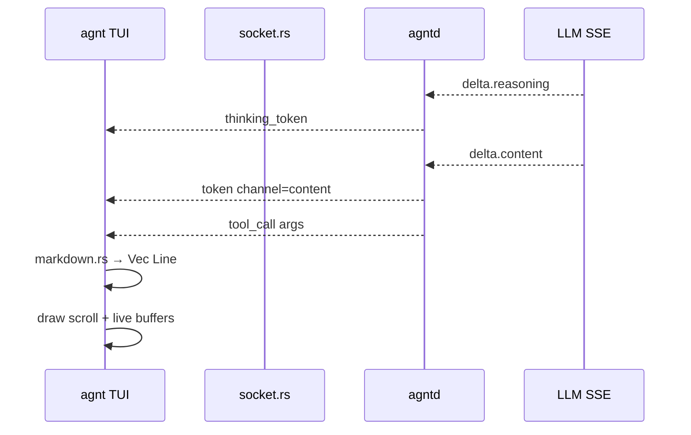

# TUI Polish Design

## Architecture



## Wire (`agnt-common`)

Extend `ServerMessage::Token`:

```rust
Token {
    content: String,
    #[serde(default)]
    channel: TokenChannel, // content | thinking
}
```

`agntd` `stream_delta_text` split into two emissions in `complete_streaming_to_writer`.

## TUI (`crates/agnt`)

| Module | Role |
|--------|------|
| `tui.rs` | App loop, input, events |
| `markdown.rs` | `pulldown-cmark` → `Vec<Line<'static>>` |
| `socket.rs` | `ServerEvent::Token { content, thinking: bool }` |

**Live buffers:** `assistant_buf`, `thinking_buf` rendered each frame when `busy`; flushed to `ChatLine::Thinking` / `ChatLine::Assistant` on tool call or turn end.

**Scroll:** Keep line-index scroll (ratatui `Paragraph::scroll`); include live buffer line count in height calc when following tail.

## Tool cards (WA-014)

`ServerEvent::ToolCall` carries `args: serde_json::Value`; display `serde_json::to_string_pretty` truncated to ~400 chars.

## Dependencies

- `pulldown-cmark` in `agnt` crate only
