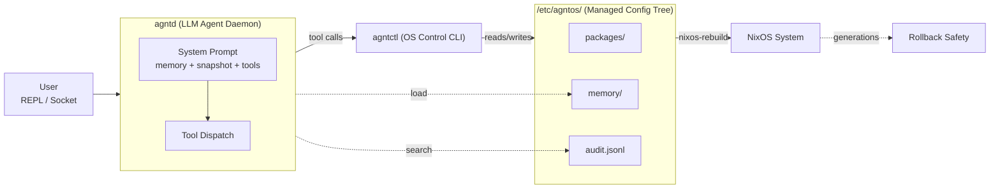

# AgntOS — Agent Guide

## What is AgntOS?

An AI-native operating system built on NixOS. The LLM is not a chatbot bolted onto the desktop -- it is the central nervous system of the machine, translating human intent into managed, reproducible system state.

**Three layers of mutation:**
- System mutation: propose -> apply -> nixos-rebuild
- Memory mutation: agent learns -> stores -> next session knows more
- Self mutation: agent writes skills -> gains new capabilities

## Key Design Decisions

### 10 tools, one agent
No modes, no profiles, no user-facing complexity. The agent has 10 typed tools:

| Tool | Confirmation | Purpose |
|---|---|---|
| `inspect` | No | Read system state (CPU, memory, GPU, disk, network) |
| `propose` | No | Stage a Nix config change with syntax validation |
| `apply` | Yes | Apply staged proposal, write Nix files, rebuild |
| `rollback` | Yes | NixOS generation rollback or surgical undo |
| `audit` | No | Query action history, search by prompt/path/package |
| `memory` | No | Curate MEMORY.md and USER.md (add/replace/remove/consolidate) |
| `read_file` | No | Read file contents |
| `write_file` | No | Create or overwrite a file |
| `edit_file` | No | Replace text in a file |
| `run_bash` | No | Execute arbitrary shell commands |

Only `apply` and `rollback` require user confirmation. Chain propose->apply without pausing.

### Pi-inspired general tools
4 primitives (read, write, edit, bash) replace dozens of specialized tools. Use `run_bash` for `ls`, `grep`, `find`, `systemctl`, `journalctl`, `dmesg`, and anything without a dedicated tool. Do NOT ask for a new tool if bash can handle it.

### Bash is king for introspection
The agent inspects system state through standard CLI tools via `run_bash`. No structured JSON introspection APIs needed -- LLMs parse text output fine.

### The /etc/agntos/ protocol
The agent writes configuration to one directory tree. NixOS imports everything in it:

```
/etc/agntos/
  packages/          Per-package Nix modules (lib.mkAfter)
  services/          Per-service enable/disable modules
  options/           Arbitrary NixOS option overrides
  proposals/         Staged config proposals (JSON)
  memory/            MEMORY.md + USER.md + sessions.db (SQLite FTS5)
  audit.jsonl        Append-only action log
  models.toml        LLM endpoint configuration
  flake-info         Flake URI for nixos-rebuild --flake
```

The agent never touches arbitrary user configuration.

### Propose -> Apply -> Audit -> Undo
1. **Propose**: generate Nix change, validate syntax with `nix-instantiate --parse`, stage as JSON
2. **Confirm**: user approves before any files change
3. **Apply**: write files, snapshot old files, run `nixos-rebuild`
4. **Audit**: record action with user's original prompt (the "why")
5. **Undo**: surgical revert reverses file operations

### Single memory system, no background extraction
The agent curates `MEMORY.md` and `USER.md` via the `memory` tool. No separate Hermes-style background pipeline. The agent, with full in-context judgment, decides what matters.

**What to store in memory:** preferences, intent, and context that can't be derived from system state.
**What NOT to store:** CPU, RAM, packages, or any fact re-inspectable via `agntctl inspect`. System facts change and are always re-derivable.

### Provenance tracking
Every `apply` records the user's original prompt. When asked "why was X done?", use `audit(search: "X")` to retrieve the recorded prompt from the audit log.

### No MCP, no plugin marketplace
The agent extends itself via bash. Need a new API? Use `run_bash` + `curl`. Need to parse a format? Use `run_bash` + `jq`/`yq`/`python3`.

## Architecture



### Components

| Component | Role | Location |
|---|---|---|
| **agntd** | LLM agent daemon. Socket/REPL modes, tool dispatch, prompt assembly. | `crates/agntd/` |
| **agntctl** | OS control CLI. All 10 tool implementations. | `crates/agntctl/` |
| **agnt-common** | Shared types: AuditEntry, ConfigProposal, CoreMemory, ModelsConfig. | `crates/agnt-common/` |

### Modes

| Mode | Command | Use case |
|---|---|---|
| REPL | `agntd` | Interactive development |
| Socket | `agntd --socket /run/agntd/agent.sock` | Systemd service |
| Keyword | Built-in fallback | No models.toml configured |

## Code Conventions

- **No comments in code** unless the logic is non-obvious. Code should be self-documenting.
- **Tests live next to the code** in Rust `#[cfg(test)] mod tests` blocks.
- **Every mutation is audited.** If you add a tool that changes system state, it must write to `audit.jsonl`.
- **Proposals are JSON** at `/etc/agntos/proposals/<id>.json`. Apply reads from there, then cleans up.
- **Nix files are generated**, not hand-edited. The agent writes them via `propose` templates.
- **Use `#[serde(default)]`** on any new field added to serialized structs (AuditEntry, ConfigProposal) so old serialized data still deserializes.

## Adding a New Tool

1. Implement the logic in `crates/agntctl/src/` (new file or existing module)
2. Add the CLI subcommand in `crates/agntctl/src/main.rs` (clap)
3. Add the LLM tool definition in `crates/agntd/src/llm.rs` (`tool_definitions()`)
4. Wire the tool execution in `crates/agntd/src/agent.rs` (`execute_tool_call()`)
5. Add tests
6. Run `cargo test`
7. Run the eval runbook in the VM: `bash .specs/features/agntos-foundation/eval-runbook.sh`

## Build & Test

```bash
cargo check        # Fast feedback
cargo test         # 55+ tests, must pass before commit
cargo build --release  # Release binary
cargo fmt          # Format before commit
```

## VM Workflow

```bash
# Build VM
export PRJ_ROOT=$(pwd)
nix build --impure .#nixosConfigurations.agntos-dev-vm.config.system.build.vm

# Run
./result/bin/run-agntos-dev-vm

# SSH
ssh -p 2222 developer@localhost

# Inside VM, rebuild agent:
cd /mnt/agntos-src && cargo build --release
```

## Project Structure

```
agntos/
  flake.nix               Nix entry point
  AGENTS.md               This file
  Cargo.toml              Rust workspace
  modules/agntos/         NixOS modules (base, desktop-plasma, agent, vm)
  profiles/               System profiles (dev-vm, plasma)
  crates/
    agnt-common/          Shared types (audit, config, memory, models)
    agntctl/              OS control CLI (10 tools)
    agntd/                LLM agent daemon
  docs/                   Documentation, banners
  .specs/                 Spec-driven project memory
    project/              Vision, roadmap, state
    features/             Feature specs, design, tasks
```

## Current State

- Phase 1 complete (agent foundation + all expansions A-C)
- Phase 1 expansions D-F in progress (memory optimization, watchdogs, home-manager)
- Phase 2 planned (model management)
- 55 tests, zero warnings
- 14/14 eval checks passing in VM
