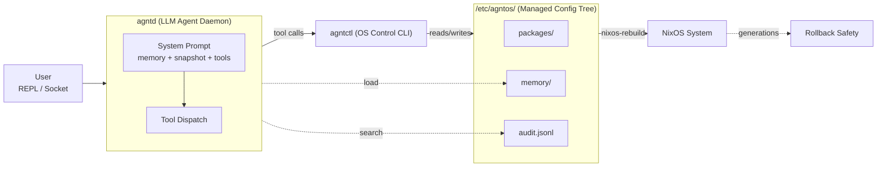

<p align="center">
  <picture>
    <source media="(prefers-color-scheme: dark)" srcset="docs/AgntOS-Banner.svg">
    
  </picture>
</p>

<p align="center">
  <strong>Mutate your OS.</strong> An agent-native operating system built on NixOS.
  <br>
  The LLM is not a sidecar -- it is the central nervous system of the machine.
</p>

- [What is AgntOS?](#what-is-agntos)
- [Why NixOS?](#why-nixos)
- [Design Decisions](#design-decisions)
- [Architecture](#architecture)
- [Tool Catalog](#tool-catalog)
- [Quick Start](#quick-start)
- [Agent Usage](#agent-usage)
- [Memory & Provenance](#memory--provenance)
- [Inspiration](#inspiration)
- [License](#license)

---

## What is AgntOS?

AgntOS is an operating system designed from the ground up under the assumption that a highly capable LLM is a first-class citizen of the system -- managing state, interpreting intent, and mediating the user's relationship with the machine.

It is **not** a terminal-based Copilot. It is not a chatbot with a few API wrappers. It is an OS that evolves itself:

```
System mutation:   propose -> apply -> nixos-rebuild
Memory mutation:  agent learns -> stores -> next session knows more
Self mutation:    agent writes skills -> gains new capabilities
```

Every change is declarative, validated, audited, and reversibly backed by NixOS generations and file-level surgical undo.

## Why NixOS?

AgntOS chose NixOS as its substrate because NixOS is the only OS where an agent can treat the entire system as a declarative artifact:

| Property | How NixOS provides it |
|---|---|
| **Clean boundary** | Agent writes `.nix` files into `/etc/agntos/`. NixOS imports from there. No side effects, no guessing. |
| **Generations = free rollbacks** | Every `nixos-rebuild` creates a bootable checkpoint. Combine with the audit log for both surgical undo and whole-system revert. |
| **Deterministic** | Same flake lock, same system. Agent changes are reproducible and verifiable before apply. |
| **Everything is an option** | Configuring a firewall, changing the hostname, enabling a service -- all Nix options. One tool (`propose set`) handles 95% of system config. |

NixOS is the foundation, not the differentiator. The point is what the agent can do on top of it.

## Design Decisions

### Rust

Performance and safety for an OS agent. Rust's type system ensures serde roundtrips are compile-time checked, file path traversal is blocked at the type level (`resolve_safe()`), and subprocess management (tokio) is async and safe. NixOS packages Rust binaries natively.

Python is too slow for CLI latency. Go lacks the type safety for audit/config schemas. Rust hits the sweet spot.

### KDE Plasma

Plasma 6 Wayland is Kirigami-native (GUI surfaces share code between desktop and mobile), Wayland-native (proper security boundaries for screen capture), KRunner-extensible (agents register actions in Alt+Space), and DBus-addressable (system tray, notifications, app launcher). It is also the best-supported desktop in nixpkgs.

### No plugin system / MCP

The Pi-inspired `read_file`, `write_file`, `edit_file`, `run_bash` replace dozens of specialized tools and an entire plugin marketplace. Need a new API? `run_bash` + `curl`. New file format? `run_bash` + `jq`/`yq`/`python3`. Adding an abstraction layer between the agent and the shell just adds failure modes.

### Single memory system

The agent curates `MEMORY.md` and `USER.md` directly via the `memory` tool. No separate background extraction pipeline -- the agent, with full in-context judgment, is the best arbiter of what matters. Two systems storing "facts about the user" create deduplication and sync problems.

Key rule: **don't store inspectable facts.** CPU, RAM, packages are re-inspectable at any time via `agntctl inspect`. Memory is for preferences, intent, and non-derivable user context.

### Bash for introspection

Building a structured JSON API for every Linux subsystem (`systemctl`, `journalctl`, `dmesg`, `ps`, `df`) means maintaining dozens of brittle wrappers. The agent uses `run_bash` for all of them. One tool, infinite reach.

The six Nix-specific tools (`inspect`, `propose`, `apply`, `rollback`, `audit`, `memory`) exist because they require structured data (JSON proposals, audit entries, memory files) that bash cannot easily represent.

### Propose -> Apply -> Audit -> Undo

Every system mutation goes through a validated pipeline:

1. **Propose**: LLM generates intent, validated by `nix-instantiate --parse`, staged as JSON
2. **Confirm**: user approves before any files change
3. **Apply**: files written, old files snapshotted, `nixos-rebuild` runs
4. **Audit**: action recorded with the user's original prompt (the "why")
5. **Undo**: surgical revert reverses file operations, warns on irreversibles

This ensures that even if the LLM generates bad config, the system is never more than one command away from a working state.

## Architecture



### Components

| Component | Role |
|---|---|
| **agntd** | LLM-powered agent daemon. Systemd user service. Accepts prompts via REPL or Unix socket. Assembles system prompt from memory + system snapshot + tool definitions. Dispatches tool calls. Persists conversations to SQLite FTS5. |
| **agntctl** | Stable OS control CLI. All agent tool calls run `agntctl` as a subprocess. Also usable directly by users. 11 tools, zero magic. |
| **agnt-common** | Shared types between agntctl and agntd: `AuditEntry`, `ConfigProposal`, `CoreMemory`, `ModelsConfig`. Serialized as JSON across the subprocess boundary. |

### The /etc/agntos/ protocol

The agent manages exactly one directory tree. NixOS imports everything in it.

```
/etc/agntos/
  packages/          Per-package Nix modules (lib.mkAfter)
  services/          Per-service enable/disable modules
  options/           Arbitrary NixOS option overrides
  proposals/         Staged config proposals (JSON)
  memory/            MEMORY.md + USER.md + sessions.db (SQLite FTS5)
  audit.jsonl        Append-only action log
  models.toml        LLM endpoint configuration
  flake-info         Flake URI for nixos-rebuild --flake
```

NixOS imports via `dirImports`:

```nix
{ config, lib, pkgs, ... }:
let
  dirImports = dir: let
    files = builtins.readDir dir;
    nixFiles = lib.filterAttrs
      (n: v: v == "regular" && lib.hasSuffix ".nix" n) files;
  in map (f: dir + "/${f}") (builtins.attrNames nixFiles);
in {
  imports = dirImports ./packages ++ dirImports ./services ++ dirImports ./options;
}
```

The agent never touches arbitrary user configuration. Clean contract, no side effects.

### Modes

| Mode | Command | Use case |
|---|---|---|
| **REPL** | `agntd` | Interactive development, debugging |
| **Socket** | `agntd --socket /run/agntd/agent.sock` | Systemd service, GUI frontends |
| **Keyword** | Built-in fallback | No `models.toml` configured |

## Tool Catalog

| Tool | Confirmation | Purpose |
|---|---|---|
| `inspect` | No | Read system state (CPU, memory, GPU, disk, network) |
| `propose` | No | Stage a Nix config change with syntax validation |
| `apply` | Yes | Apply staged proposal, write Nix files, rebuild |
| `rollback` | Yes | NixOS generation rollback or surgical undo |
| `audit` | No | Query action history, search by prompt/path/package |
| `memory` | No | Curate MEMORY.md and USER.md |
| `read_file` | No | Read file contents |
| `write_file` | No | Create or overwrite a file |
| `edit_file` | No | Replace text in a file |
| `run_bash` | No | Execute arbitrary shell commands |

Only `apply` and `rollback` require user confirmation.

## Quick Start

### Prerequisites

- Nix with flakes enabled (`nix flake` works)
- An OpenAI-compatible LLM endpoint

### Build and run the dev VM

```bash
git clone https://github.com/your-org/agntos
cd agntos

export PRJ_ROOT=$(pwd)
nix build --impure .#nixosConfigurations.agntos-dev-vm.config.system.build.vm

./result/bin/run-agntos-dev-vm
```

First boot opens QEMU with a NixOS disk image booting into Plasma 6.

### Login

- **User**: `developer` / password: `agntos`
- **SSH**: `ssh -p 2222 developer@localhost`

### Configure the LLM endpoint

```bash
sudo cp /etc/agntos/models.toml.example /etc/agntos/models.toml
sudo editor /etc/agntos/models.toml
export AGNTOS_API_KEY=your-key
```

### First interactions

```bash
# CLI
agntctl inspect system
agntctl propose "install htop"
agntctl apply p-<id>

# Agent
export AGNTOS_API_KEY=your-key
agntd
```

See [DEVELOPMENT.md](DEVELOPMENT.md) for VM management, build instructions, testing, and project structure.

## Agent Usage

### REPL mode

```bash
export AGNTOS_API_KEY=your-key
agntd
```

Type anything -- the agent uses tools as needed. Use `history <query>` to search past conversations via SQLite FTS5.

### Socket mode (systemd)

```bash
agntd --socket /run/agntd/agent.sock

echo '{"prompt":"install htop"}' | nc -U -N /run/agntd/agent.sock
```

The systemd user service starts `agntd` in socket mode automatically on login.

### Asking about past actions

```
You:    Why is btop installed?
Agent:  btop was installed because you requested a way to monitor
        system memory usage.
```

The agent calls `audit(search: "btop")` to retrieve the recorded prompt from the audit log.

### Model configuration

Edit `/etc/agntos/models.toml`:

```toml
[default]
endpoint = "http://localhost:8081/v1"
model = "your-model"
api_key_env = "AGNTOS_API_KEY"
max_tokens = 4096
temperature = 0.7

[routing]
inspect = "default"
propose = "default"
apply = "default"
chat = "default"
memory = "default"
```

Task-class routing lets you assign different models for different tasks.

## Memory & Provenance

### Core Memory

Two markdown files with hard character caps:

| File | Capacity | Purpose |
|---|---|---|
| `MEMORY.md` | 2,200 chars | System facts, conventions, constraints |
| `USER.md` | 1,375 chars | User preferences, workflow patterns, intent |

Both files are loaded as a frozen snapshot into every LLM call -- always in context. The agent updates them via the `memory` tool (add, replace, remove, consolidate). When memory exceeds 80% capacity, the agent consolidates: deduplicates and merges similar entries.

### What belongs in memory

The agent stores **preferences and intent**, not inspectable system state:

- "User prefers Helix over Neovim" -- stored
- "This is a Rust development machine" -- stored
- "User hates Flatpaks" -- stored
- "GPU is QEMU Bochs" -- not stored (re-inspectable via `agntctl inspect`)
- "8GB RAM" -- not stored (re-inspectable)
- "htop is installed" -- not stored (re-inspectable)

### Provenance (the "why")

Every `apply` stores the user's original prompt in the audit entry. The agent retrieves it naturally:

```bash
agntctl audit search --query "btop"

# a-18afd0609a47cbdf | 2026-05-15 18:24:51 | OK | Applied: Install package: btop
#   | Prompt: I need to monitor system memory usage
```

The system prompt teaches the agent to use `audit search` when asked "why was X done?".

## Inspiration

| Project | What we borrowed |
|---|---|
| **[NixOS](https://nixos.org/)** | Declarative, reproducible, rollbackable system mutations. The only OS where an agent can safely own a config directory. |
| **[Pi](https://github.com/badlogic/pi-mono)** (Mario Zechner) | Minimal core (4 primitives): read, write, edit, bash. Agent builds its own tools. No MCP, no plugin marketplace. |
| **[Hermes](https://github.com/NousResearch/hermes-agent)** (NousResearch) | Bounded curated memory, frozen snapshots, agent-curated knowledge. (We use the memory concept, not the background extraction pipeline.) |

## License

Copyright (C) 2026  AgntOS contributors

This program is free software: you can redistribute it and/or modify
it under the terms of the GNU General Public License as published by
the Free Software Foundation, either version 3 of the License, or
(at your option) any later version.

This program is distributed in the hope that it will be useful,
but WITHOUT ANY WARRANTY; without even the implied warranty of
MERCHANTABILITY or FITNESS FOR A PARTICULAR PURPOSE.  See the
GNU General Public License for more details.

You should have received a copy of the GNU General Public License
along with this program.  If not, see <https://www.gnu.org/licenses/>.
